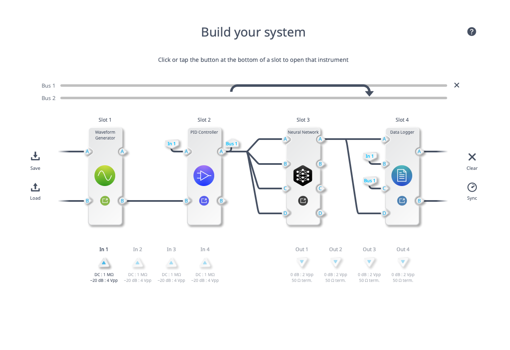
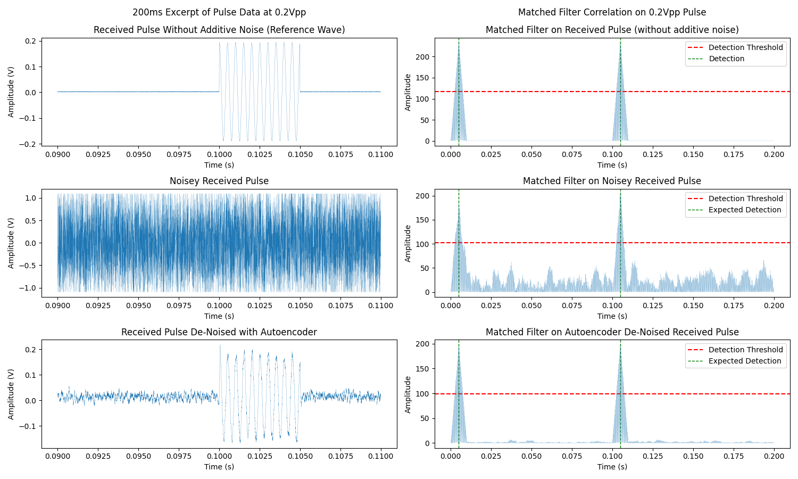
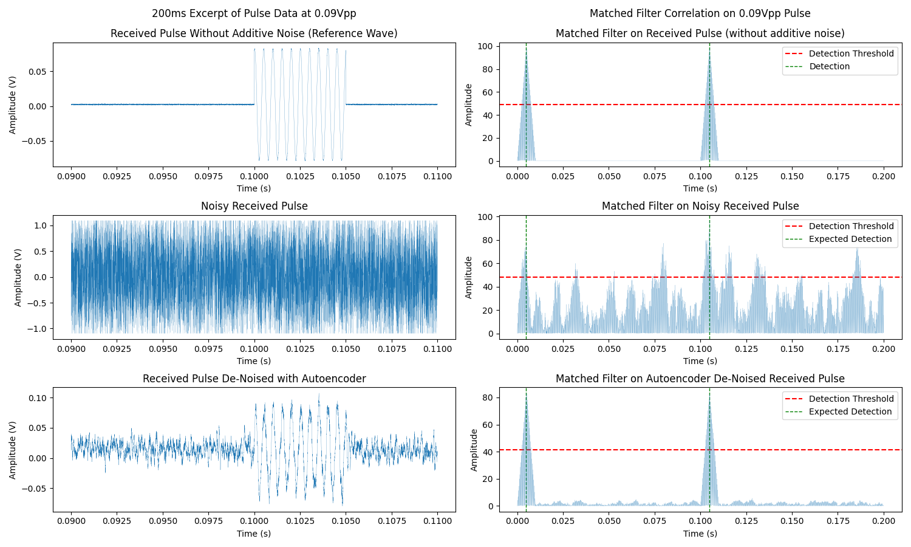
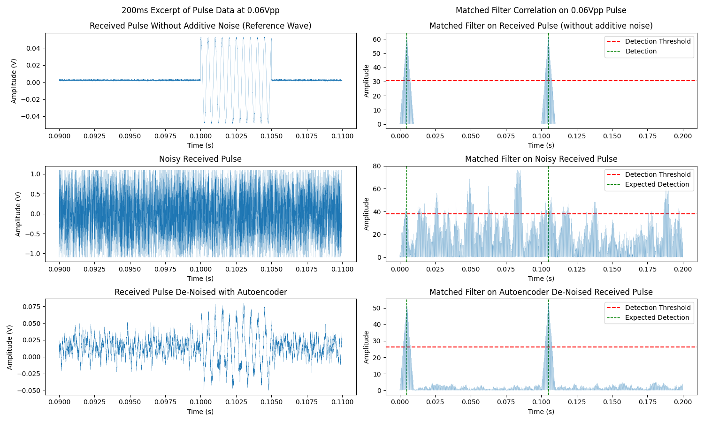
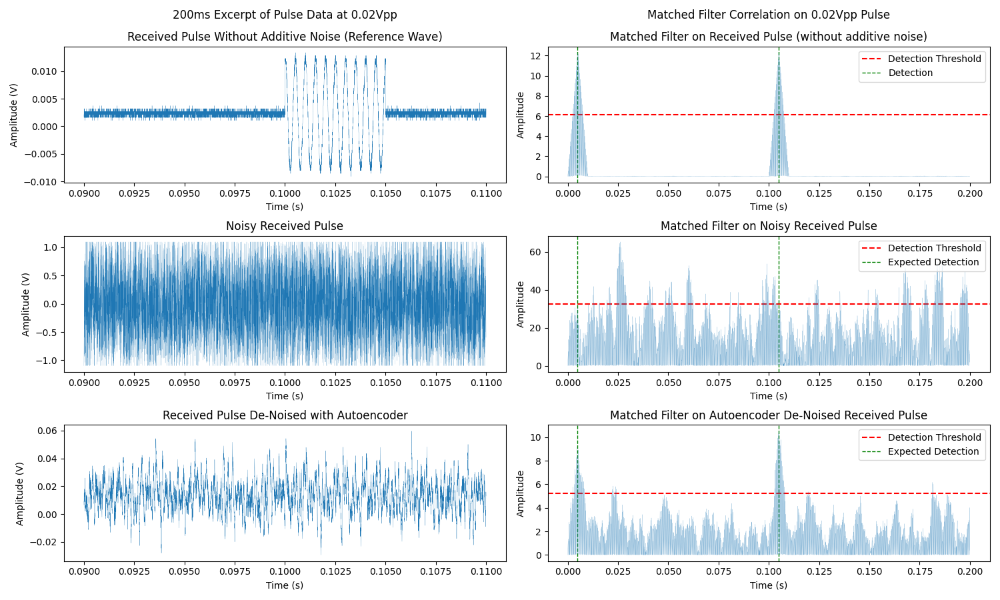

# Moku Neural Network Example - Pulsed RADAR

The example code in this directory is designed to highlight the following capabilities:

- Application of [autoencoder](https://github.com/liquidinstruments/moku-examples/blob/main/neural-network/Autoencoder.ipynb) Neural Network Capability.  Click the link for a Jupiter Notebook demonstration.
- Python API configuration of Neural Network and Multi Instrument Mode
- Python ability to load and process data logger files
- Python API configuration with multiple Moku devices

## Overview
In this example we will use a Moku:Go running the waveform generator to first generate a pulsed waveform.  This pulsed waveform is designed to represent the type of data commonly used in RADAR applications.  The pulsed waveform will then be received by a Moku:Pro running in multi instrument mode.  We will use the control matrix within the PID controller to add noise to the waveform, the neural network instrument configured according to the [autoencoder](https://github.com/liquidinstruments/moku-examples/blob/main/neural-network/Autoencoder.ipynb) example to de-noise the signal.  Finally we will use the data logger to store data samples in .csv format for follow on processing and analysis.

## Included Files
The following files are included to aid with reproducing the results highlighted below.

- **mim\_wg\_pid\_nn\_dl.py** will set up the Multi-instrument mode environment and record 20 samples of data with varying levels of Signal to Noise Ratio (SNR)
- **matchedFilter.py** will apply a matched filter to each of the samples of data to allow for comparison of performance between non-noisy, noisy and de-noised signal
- **createVideo.py** will create a video from the analyzed frames of data to show how decreasing SNR results in additional false detects and failure to detect pulse
- **autoencoder_32.linn** is the Liquid Instruments Neural Network file that was created with the [autoencoder](https://apis.liquidinstruments.com/mnn/examples/Autoencoder.html) tutorial

## Example RADAR Pulse
The following pulse is representative of the type of signal that would be used in a basic pulsed RADAR.  There are many more complex techniques often employed, but for purposes of this example we will stick with the basic pulsed waveform

### Pulse parameters
- Carrier Frequency - 2kHz
- Pulse Width - 5ms
- Pulse Repetition Frequency - 10Hz

### Moku:Go Configuration
We use the Moku:Go with the to generate a waveform with the desired pulse parameters specified above.  Below is an example configuration.

### Moku:Pro Multi-instrument Mode Configuration
Using the Python API, we will establish the following configuration on the Moku:Pro in Multi-instrument Mode. 

- Slot 1 - Waveform Generator to generate noise
- Slot 2 - PID Controller to use control matrix to combine noise with pulsed signal
- Slot 3 - Neural Network with previously built autoencoder *.linn file
- Slot 4 - Data Logger used to store 0.2s snapshots of data

## Results
With sufficient SNR, matched filters are excellent tools to identify precise location of a known pulse type within a signal.  As shown below, the signal is tough to identify visually in the presence of noise, but the matched filter can effectively pull this signal out of the noise.  The signal processed in real time with the Neural Network instrument further improves the performance of the matched filter and would allow for a lower detection threshold. 

As SNR decreases, we start to see false detections with the chosen threshold on the noisy signal, but the de-noised signal through the Neural Network still allows for flawless identification of the pulses and would still allow for a lower detection threshold.  

With an even further reduction in SNR, the ability to detect the pulses in the noisy signal is completely lost.  However the signal de-noised in real time through the Neural Network continues to perform well.

Eventually a further reduction in SNR will begin to limit the performance of the de-noised signal with the Neural Network.  However, this de-noising technique does present significant improvement in performance.  On the following plot, we start to see false detections, but the true detections are still accurate.  

